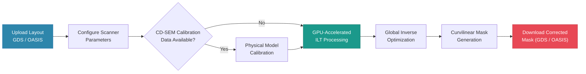

# OPC+ Cloud Platform

**Cloud-Based Freeform Mask Correction Platform**

*Next-Generation GPU-Accelerated OPC for Semiconductor & Photonics*

Developed by [PAL Lab](https://nycu-pal.com/) · National Yang Ming Chiao Tung University

*Accelerate · Automate · Innovate*

---

## Table of Contents

- [Background](#background)
- [The OPC+ Solution](#the-opc-solution)
- [Experimental Results](#experimental-results)
- [Key Features](#key-features)
- [Complete Correction Workflow](#complete-correction-workflow)
- [Technical Comparison](#technical-comparison)
- [Getting Started](#getting-started)
- [Use Cases](#use-cases)
- [Deployment Models](#deployment-models)
- [Industry Validation](#industry-validation)
- [Platform Demo & Access](#platform-demo--access)
- [Contact](#contact)

---

## Background

### What Is Optical Proximity Correction (OPC)?

Semiconductor and photonic devices are fabricated by projecting light through a patterned mask onto a photosensitive wafer—a process called **photolithography**. Because the wavelength of the exposure source is comparable to, or larger than, the minimum feature sizes being printed, **optical diffraction** causes the projected image to deviate systematically from the intended design: corners round off, line widths shift, and isolated features may fail to print entirely.

**Optical Proximity Correction (OPC)** is the pre-distortion technique applied to the mask layout to compensate for these optical and process-induced effects, so that the final printed pattern on the wafer faithfully reproduces the designer's intent.

*Figure 1. Comparison of a target layout (without correction) and an OPC-corrected mask. The pre-distorted mask compensates for diffraction so that the wafer image matches the intended design.*

### Why Is Traditional OPC Insufficient?

Conventional OPC tools rely on CPU-based, rule-driven solvers designed for **Manhattan geometries** (rectilinear, axis-aligned shapes). They present three fundamental limitations as the industry advances:

| Limitation | Impact |
|---|---|
| **Speed** | CPU-bound serial processing makes large-layout corrections extremely time-consuming—often taking hours per job |
| **Cost & Accessibility** | Commercial licenses are prohibitively expensive and operation requires specialized expertise, excluding startups and research institutions |
| **Geometry Constraints** | Emerging applications in photonic integrated circuits and next-generation curvilinear CMOS nodes require freeform mask geometries that traditional tools cannot handle natively—forcing lossy polygonal approximation |

---

## The OPC+ Solution

OPC+ is a **cloud-native, GPU-accelerated** platform that democratizes advanced mask correction. By replacing CPU-bound solvers with massively parallel GPU computation and wrapping the entire workflow in an intuitive web interface, OPC+ removes the barriers of traditional tools while extending OPC capabilities to cutting-edge photonic and semiconductor applications.

The platform is built around three principles:

- **Speed**: CUDA Multi-Stream parallelism delivers 50× faster correction than CPU-based solvers \[5\]
- **Accessibility**: A web-based GUI requires no scripting or deep OPC expertise — upload a layout, configure parameters, and submit
- **Generality**: Native curvilinear mask support enables OPC beyond digital CMOS, validated on photonic integrated circuits and metasurfaces \[2\]\[3\]

---

## Experimental Results

The following Scanning Electron Microscope (SEM) images present fabricated device results demonstrating the direct, measurable impact of OPC correction on real photonic structures.

### Line Pattern — Line End Shortening

Without OPC correction, diffraction at the tips of line features causes the printed ends to **recede inward**, resulting in lines that are shorter than the target design. This line end shortening effect introduces critical dimension (CD) error along the line length axis. OPC pre-compensation extends the mask geometry at line ends so that the fabricated result matches the intended length.

| Without OPC | With OPC |
|:-----------:|:--------:|
|  |  |
| Line end shortening visible; printed length undershoots target | Line ends accurately reproduced; CD along length axis restored |

*Figure 3. SEM images of fabricated line patterns. Scale bar: 5 µm.*

### Ring Resonator — Defect Elimination

For photonic ring resonators, OPC correction is critical to device functionality. Without correction, the coupling gap region fails to open properly—a fatal defect for optical performance. With OPC, the waveguide geometry is accurately reproduced and the device is fully functional.

| Without OPC | With OPC |
|:-----------:|:--------:|
|  |  |
| Critical defect: lower photoresist layer not opened (circled) | Clean fabrication: coupling region fully resolved |

*Figure 4. SEM images of fabricated ring resonators. Scale bar: 5 µm (overview), 1 µm (inset).*

### Metalens — Sub-Wavelength Feature Survival

Metalenses rely on densely packed sub-wavelength nano-structures whose precise geometry determines the phase profile of the device. Without OPC, the photolithography process fails to resolve the smallest features—they are either significantly distorted or lost entirely—compromising the optical function of the device. With OPC, all features are faithfully reproduced after lithography, preserving the intended phase distribution across the aperture \[2\].

| Without OPC | With OPC |
|:-----------:|:--------:|
|  |  |
| Small features fail to resolve; critical nano-structures lost or severely distorted after lithography | All sub-wavelength features fully resolved; phase profile of metalens preserved |

*Figure 5. SEM images of fabricated metalens structures. OPC ensures survival of all sub-wavelength features critical to device phase control.*

---

## Key Features

### GPU Acceleration

Leveraging CUDA Multi-Stream image-level parallelism, OPC+ achieves **50× faster** mask correction compared to traditional CPU-based methods. Jobs that previously required hours complete in minutes, enabling rapid design iteration.

### Cloud-Native Architecture

Built on Kubernetes with elastic resource scheduling, OPC+ dynamically allocates GPU resources across public, private, or hybrid cloud environments. No capital expenditure on hardware, no maintenance overhead.

### Native Freeform and Curvilinear Mask Support

Unlike traditional tools that force curved designs into rectilinear approximations, OPC+ natively generates **curvilinear masks**—preserving optical phase, waveguide coupling efficiency, and device performance for photonic applications.

### Accessible Interface — "OPC for Everyone"

Upload a target layout (GDS/OASIS), configure scanner parameters, and submit. The platform handles the rest. No scripting, no deep OPC expertise required. Suitable for both experienced lithography engineers and researchers new to mask correction.

### Global Inverse Optimization

The correction engine uses full-mask **inverse lithography technology (ILT)** with contour-based L2 optimization, achieving superior pattern fidelity and CD uniformity compared to rule-based windowed correction approaches.

### Predictable Turnaround Time

Two-tier dynamic workload scheduling maintains **less than 2% execution imbalance** across heterogeneous GPU nodes, enabling reliable and consistent job delivery.

### Industry-Standard Format Support

Seamless integration with existing EDA workflows through native support for **GDS/OASIS** layout files and **CD-SEM** calibration data.

---

## Complete Correction Workflow

OPC+ integrates three essential modules into a unified, automated pipeline:

### 1. OPC Correction (Mask Correction)

Advanced full-mask inverse lithography with contour-based L2 optimization. Achieves holistic pattern fidelity superior to traditional edge-placement error (EPE) rule-based correction.

### 2. Aerial Image Simulation (Computational Lithography)

High-fidelity imaging simulation incorporating user-defined scanner parameters: exposure wavelength, numerical aperture (NA), spatial resolution, and illumination source configuration.

### 3. Physical Model Calibration

Analytical imaging models are fitted to actual lithography process data using CD-SEM measurements. Accounts for scanner-specific, resist, and process variations to ensure accurate predictive modeling tailored to a specific fabrication environment.

---

## Technical Comparison

| Category | Traditional OPC | OPC+ Cloud | Business Benefit |
|---|---|---|---|
| **Mask Geometry Support** | Manhattan-based (rectilinear only) | Native curvilinear and freeform | Preserves optical phase and device performance |
| **Design Conversion** | Requires polygon fracturing / Manhattanization | No geometry approximation required | Eliminates layout-induced performance loss |
| **Optimization Method** | Local rule-based or windowed EPE | Global full-mask inverse optimization | Higher pattern fidelity and CD uniformity |
| **GPU Utilization** | Limited or static GPU assignment | Cost-performance-aware dynamic allocation | Optimal cost vs. throughput tradeoff |
| **Parallelism** | Limited job-level parallelism | CUDA Multi-Stream image-level parallelism | Faster processing of large layouts |
| **Workload Scheduling** | Static or FIFO | Two-tier dynamic scheduling | Balanced execution across heterogeneous GPUs |
| **Turnaround Predictability** | Variable, bottleneck-prone | <2% execution imbalance across nodes | Reliable delivery schedules |
| **Deployment Model** | On-premises only | Public, private, or hybrid cloud | Fits foundry security and IT policies |
| **Manufacturing Validation** | Logic-centric benchmarks | Validated on photonics and metasurfaces | Proven beyond digital CMOS |
| **Future Readiness** | Limited for curvilinear CMOS | Ready for next-generation curvilinear nodes | Enables new process node offerings |

---

## Getting Started

### Prerequisites

- Target layout file in **GDS or OASIS** format
- Scanner parameters (wavelength, NA, illumination configuration)
- *(Optional)* CD-SEM calibration data for physical model fitting

### Step-by-Step

1. **Access the Platform**
   Navigate to [https://nycu-opcplatform.ddns.net/](https://nycu-opcplatform.ddns.net/) and register an account. The platform supports both English and Traditional Chinese interfaces.

   

   

   *Figure 5. OPC+ web portal login page. Select your preferred language from the top-right menu.*

   

2. **Upload Your Design**
   Upload your target layout file (GDS/OASIS) and enter the scanner parameters for your process.

3. **Configure Calibration** *(Optional)*
   Upload CD-SEM measurement data if physical model calibration is required for your fabrication environment.

4. **Submit and Monitor**
   Submit your job to the GPU cluster. Track progress in real time through the web dashboard.

5. **Download Results**
   Retrieve the corrected mask layout (GDS/OASIS), ready for mask writing and manufacturing.

---

## Use Cases

### Semiconductor Manufacturing

- Advanced process node development (7 nm, 5 nm, 3 nm and beyond)
- Semiconductor foundries and mask shops
- Fabless design houses
- Research and development laboratories

### Photonic Integrated Circuits (PICs)

- Silicon photonic waveguides and ring resonators
- Apodized grating couplers
- Metasurfaces and metalenses
- Curvilinear photonic patterns requiring native freeform correction

### General Applications

- High-volume manufacturing tape-out support
- Rapid design prototyping and process exploration
- Academic research in computational lithography

---

## Deployment Models

OPC+ offers flexible deployment options to meet security, performance, and budgetary requirements.

| | Public Cloud | Private Cloud | Hybrid Model |
|---|---|---|---|
| **Infrastructure** | Managed 12+ GPU cluster | Custom on-premises deployment | Combined public and private resources |
| **Data Control** | Standard cloud security | Maximum IP security and data isolation | Configurable per workload sensitivity |
| **Management** | Fully managed, no overhead | Dedicated resources, full control | Flexible resource allocation |
| **Best For** | Startups, research labs, rapid prototyping | Large enterprises, sensitive IP projects | Organizations with variable workload demands |

---

## Industry Validation

OPC+ is developed by the **National Yang Ming Chiao Tung University (NYCU)** research team and has been validated through collaborative engagements with leading institutions:

- **Taiwan Semiconductor Research Institute (TSRI)**
- **University of Southampton, UK**

The platform bridges cutting-edge academic research in computational lithography with real-world industrial fabrication requirements.

---

## Platform Demo & Access

**Click the logo below to watch the platform demonstration.**

*OPC+ Cloud Platform — GPU-accelerated mask correction service*

**Platform URL**: [https://nycu-opcplatform.ddns.net/](https://nycu-opcplatform.ddns.net/)

To request access for research or professional use, register directly on the platform or contact the team via the information below.

**Supported by**: National Science and Technology Council (NSTC), Taiwan

---

## Contact

| | |
|---|---|
| **Principal Investigator** | [Prof. Peichen Yu](https://nycu-pal.com/pi.html) |
| **Email** | peichen.yu@nycu.edu.tw |
| **Lab Websites** | [PAL Lab — Photonics & Advanced Lithography](https://nycu-pal.com/) · [NSL Lab — Network and System Laboratory](https://nsl.cs.nycu.edu.tw) |
| **Platform** | [https://nycu-opcplatform.ddns.net/](https://nycu-opcplatform.ddns.net/) |
| **Institution** | [National Yang Ming Chiao Tung University (NYCU)](https://www.nycu.edu.tw/) |
| **Address** | No. 1001 University Road, East District, Hsinchu City 300, Taiwan |
| **Phone** | +886-3-5712121 ext. 56357 |

---

## References

The following publications document the research and validation underpinning the OPC+ platform.

**Foundational References**

\[1\] C. Mack, *Fundamental Principles of Optical Lithography: The Science of Microfabrication*. John Wiley & Sons, 2007.

\[2\] L. Pang, "Inverse lithography technology: 30 years from concept to practical, full-chip reality," *Journal of Micro/Nanopatterning, Materials, and Metrology*, vol. 20, no. 3, pp. 030901–030901, 2021.

**Research Publications**

\[3\] S.-Y. Wang et al., "Providing optimal optical proximity correction cloud services for the semiconductor industry," in *IEEE International Conference on Cloud Computing Technology and Science (CloudCom)*, IEEE, 2025.

\[4\] P.-H. Fang and P. Yu, "Tackling data inconsistency and runtime issues in inverse lithography technology (ILT) with comparative convergence study," in *DTCO and Computational Patterning III*, vol. 12954, SPIE, 2024, p. 129541E.

\[5\] H.-L. Liu et al., "Intelligent proximity correction enabled large-area metasurfaces by KrF photolithography," *IEEE Access*, vol. 13, pp. 195517–195525, 2025.

\[6\] Y. Shen, N. Wong, and E. Y. Lam, "Level-set-based inverse lithography for photomask synthesis," *Optics Express*, vol. 17, no. 26, pp. 23690–23701, 2009.

\[7\] K.-H. Wang, P.-H. Fang, and P. Yu, "Practical inverse mask synthesis via data-efficient physics-informed neural networks (PINN) model," in *DTCO and Computational Patterning IV*, vol. 13425, SPIE, 2025.

\[8\] P.-H. Fang, Y.-S. Chen, J.-S. Wu, and P. Yu, "Inverse reticle optimization with quantum annealing and hybrid solvers," *IEEE Access*, vol. 12, pp. 33069–33078, 2024.

---

*Developed by the NYCU OPC Research Team · Department of Photonics · Hsinchu, Taiwan*

